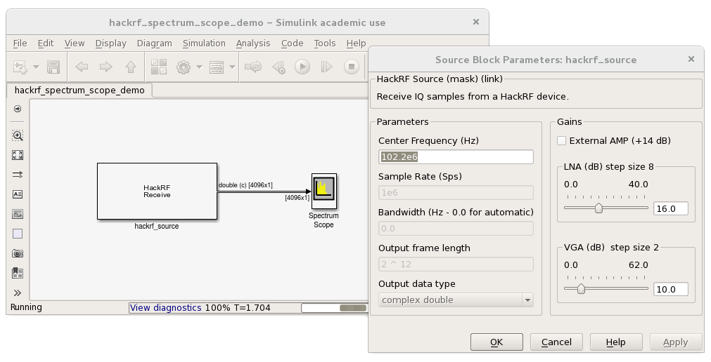

Simulink-HackRF
================

The Simulink-HackRF project is an Open Source Software Package allows interfacing MATLAB Simulink models with a HackRF device in real-time. Simulink-HackRF uses libhackrf to transmit or receive IQ samples. It is thus possible to build a wide variety of signal processing and wireless communication applications directly in Simulink while being able to test them on real hardware at the same time.



The Simulink-HackRF project was initiated at the *Communication Engineering Lab (CEL)* at the *Karlsruhe Institute of Technology (KIT)*, Germany, <http://www.cel.kit.edu>.

Requirements
------------

- MATLAB/Simulink (tested with R2015b) and [compatible compiler](http://www.mathworks.de/support/compilers)

- *hackrf* library (tested with 2014.08.1) from the [Project GitHub page](https://github.com/mossmann/hackrf/releases "hackrf github releases page")

- Windows only: *POSIX Threads for Win32* from the [Project page](http://sourceware.org/pthreads-win32/)

Build instructions for Linux
----------------------------

1. Make sure MATLAB's ```mex``` compile script is configured. Open a MATLAB console:

		>> mex -setup C
		MEX configured to use 'gcc' for C language compilation.
		...

	You can also enter ```$ mex -setup C``` a terminal (MATLAB executables must be in your PATH). 

2. Get, (build) and install the *hackrf* library and tools: You can use the link above or install ```hackrf*``` from your OS package repositories, if available. Make sure to include the development packages. Additional information can be found in the [HackRF Wiki](https://github.com/mossmann/hackrf/wiki).

3. To test your *hackrf* installation plug-in your device and run the included application

		$ hackrf_info
		Found HackRF board.
		...

    If your device is not found, you can consult the [HackRF FAQ](https://github.com/mossmann/hackrf/wiki/FAQ) for more information.

4. Get the Simulink-HackRF source from [GitHub](https://github.com/kit-cel/simulink-hackrf).

		$ git clone git://github.com/kit-cel/simulink-hackrf.git

	If you aren't using *git* you can get the [latest release](https://github.com/kit-cel/simulink-hackrf/releases/latest). Extract the archive to any folder you want.
		
5. There are two options for compiling the Simulink-HackRF blocks:

	- Run MATLAB, switch to your Simulink-HackRF directory and start the build process via

   			>> make

	    You might need to adapt the include and lib path for the *hackrf* library at the top of make.m to reflect your setup. Finally, add the *build* directory to the MATLAB Path.
		
	- As an alternative you can use CMake:
    	 
            $ cd simulink-hackrf
            $ mkdir build && cd build
            $ cmake ..
            ...
            $ make
            $ make install

        ```$ make install``` puts all required files in *~/Documents/MATLAB* which is in the MATLAB Path by default. You can also skip this step and add the *build* directory to the MATLAB Path instead.

6. After a refresh, you will find a new Toolbox named "HackRF" in the *Simulink Library Browser*. A simple spectrum scope model and a single-tone transmitter model is located in the directory *demos*. Also, there is MATLAB command ```>> hackrf_find_devices``` which you can use to test your setup.


Build instructions for Microsoft Windows
----------------------------------------

1. Install a compiler and setup MATLAB's ```mex``` compile script: Here, we will use MinGW64 which is support since MATLAB 2015b. To set it up follow the [instructions on the Mathworks page](http://de.mathworks.com/help/matlab/matlab_external/install-mingw-support-package.html). Next, add the MinGW64 bin directory to your PATH (default is C:\TDM-GCC-64\bin)
To double-check, open a MATLAB console:

		>> mex -setup C
		MEX configured to use 'MinGW64 Compiler (C)' for C language compilation.
		...

2. Get the Simulink-HackRF source from [GitHub](https://github.com/kit-cel/simulink-hackrf). If you aren't using *git* you can get the [latest release](https://github.com/kit-cel/simulink-hackrf/releases/latest). Extract the archive and create a subdirectory *deps* in there.

3. Build the *hackrf* library (based on [libhackrf README](http://github.com/mossmann/hackrf/tree/master/host/libhackrf)):

    - First, get the hackrf source code by cloning the repo or download it as an archive and extract. Next, you need to install [CMake](http://cmake.org/) as well as windows binaries for [libusb](http://libusb.info).

    - Start the CMake-GUI and set the source directory to your libhackrf sources, that is subdirectory 'host/libhackrf' in the repo. Create a directory 'build' in there and set it as the binaries directory in the CMake-GUI. Next, hit Configure and select 'MinGW Makefiles' as generator. Set the CMAKE_INSTALL_PREFIX to the 'deps' directory you created above. You will probably have to set the the include and lib settings for libusb manually: LIBUSB_INCLUDE_DIR must be set to the libusb directory, subfolder 'include/libusb-1.0'. LIBUSB_LIBRARIES can point to the static library shipped with the libusb binaries, 'MinGW64/static/libusb-1.0.a'. Finally, press Generate.

    - Open the *MinGW Command Prompt*, navigate to the 'libhackrf/build' directory and run ```mingw32-make``` to build the hackrf library. Next, run ```mingw32-make install```.

4. Get [Zadig](http://zadig.akeo.ie), plug-in your device and run Zadig and install the driver.

5. Run MATLAB, switch to your Simulink-HackRF directory and start the build process via

			>> make

	If you get errors, create an empty file libhackrf.lib in 'deps/bin/' and rerun. Copy libhackrf.dll from 'deps/bin' into the 'build' folder. Finally, add the *build* directory to the MATLAB Path.

6. After a refresh, you will find a new Toolbox named "HackRF" in the *Simulink Library Browser*. A simple spectrum scope model and a single-tone transmitter model is located in the directory *demos*. Also, there is MATLAB command ```>> hackrf_find_devices``` which you can use to test your setup.

video install HackRFOne in matlab on Win8
[Install simulink-hackrf in win8](https://www.youtube.com/watch?v=7dtikuo3BSw)

Known issues / Future plans
---------------------------

- Feature: Add support for multiple HackRF devices introduced in *libhackrf* version 2015.07.1  


Copyright
---------

The Simulink-HackRF interface consists of software from several authors. The following table lists all included software packages:

- *Simulink-HackRF*  
  Authors: Communication Engineering Lab (CEL), Sebastian Koslowski  
  License: GNU General Public License  
  Source:  https://github.com/kit-cel/simulink-hackrf
- *libhackrf* and *hackrf-tools*  
  Principal Author: Michael Ossmann  
  License: GNU General Public License  
  Source:  https://github.com/mossmann/hackrf

Contact and Support
-------------------

If you have further questions concerning the Simulink-HackRF interface (e.g. the build process) or you've found a bug, please feel free to contact us:

- Sebastian Koslowski <sebastian.koslowski@kit.edu>


Change-log
---------

(see https://github.com/kit-cel/simulink-hackrf/releases)
